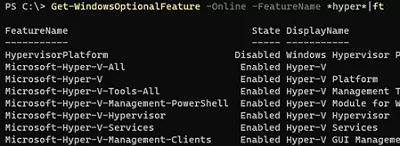
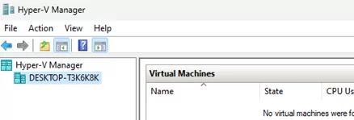
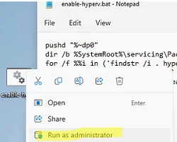
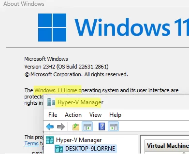

# Windows OS Hub / Virtualization / Hyper-V / Enable Hyper-V on Windows 10/11 Pro and Home Editions  
August 12, 2024  
https://woshub.com/enable-hyper-v-windows-pro-home/

https://forums.docker.com/t/cannot-start-my-windows-10-vm-after-install-docker-desktop/144869/9
## Enable Hyper-V on Windows 10/11 Pro and Home Editions
In addition to the Windows Server platform, the Hyper-V virtualization platform is also available in the desktop Windows editions. Users can create and run virtual machines using the built-in Hyper-V hypervisor. This article explains how to enable the Hyper-V feature on Windows 10 and 11.

The Hyper-V virtualization feature can be installed on the Pro and Enterprise editions of Windows 10 and 11. 
### First, check that your computer hardware supports Hyper-V virtualization. 

Open a command prompt as an administrator and run:

    systeminfo

Scroll down to the bottom of the output and check that the following components are enabled under Hyper-V Requirements:
    VM Monitor Mode Extensions: Yes
    Virtualization Enabled In Firmware: Yes
    Second Level Address Translation: Yes
    Data Execution Prevention Available: Yes

### use the systeminfo command to check hyper-v requirements

If it says Virtualization Enabled in Firmware: No, enable hardware virtualization support in your computer’s BIOS/UEFI settings (it may be called Intel VT-X or AMD-V).

### Open Performance/CPU tab in the Task Manager  
check the processor compatibility:   

    Virtualization: Enabled
should be specified here.

Check if hardware Virtualization in enabled using the Task Manager
If the Hyper-V components are already installed, you will see the message:
A hypervisor has been detected. Features required for Hyper-V will not be displayed.

# For Windows 10/11 Pro/Enterprise 
# Windows Features applet in the Control Panel can be used to enable the Hyper-V role. Run the optionalfeatures command and select the Hyper-V Platform and Management Tools features to install.

Windows Features enable Hyper-V

Alternatively, enable the Hyper-V feature from the PowerShell command prompt:

    Enable-WindowsOptionalFeature -Online -FeatureName Microsoft-Hyper-V -All

Or with DISM:

    dism.exe /Online /Enable-Feature:Microsoft-Hyper-V-All

    PowerShell: Enable-WindowsOptionalFeature Microsoft-Hyper-V 

Restart the computer after the features are installed. 

Check that hypervisor features are enabled:  

    Get-WindowsOptionalFeature -Online -FeatureName *hyper*|ft  
..
..
## Enable Hyper-V to start automatically:
    bcdedit /set HypervisorLaunchType auto

## The Hyper-V Manager GUI tool can be used to manage Hyper-V and virtual machines (virtmgmt.msc).  
..
..

It is also possible to use PowerShell to manage Hyper-V and VMs.

# The Hyper-V feature is not available in the Home editions of Windows 10 and 11.  
## However, a little trick allows installing the Hyper-V and VirtualMachinePlatform features from the WinSxS component store (C:\Windows\servicing\Packages) even in the Home Windows edition.

 To add Hyper-V packages create a 2 batch files with the following code:

    pushd "%~dp0"
    dir /b %SystemRoot%\servicing\Packages\*Hyper-V*.mum >hyper-v.txt
    for /f %%i in ('findstr /i . hyper-v.txt 2^>nul') do dism /online /norestart /add-package:"%SystemRoot%\servicing\Packages\%%i"
    del hyper-v.txt
    Dism /online /enable-feature /featurename:Microsoft-Hyper-V -All /LimitAccess /ALL
    pause
..

    pushd "%~dp0"
    dir /b %SystemRoot%\servicing\Packages\*HyperV*.mum >hyperV.txt
    for /f %%i in ('findstr /i . hyperV.txt 2^>nul') do dism /online /norestart /add-package:"%SystemRoot%\servicing\Packages\%%i"
    del hyperV.txt
    Dism /online /enable-feature /featurename:Microsoft-Hyper-V -All /LimitAccess /ALL
    pause

Run the BAT file as an administrator.  
  
  

Once the components are installed, restart the computer. Check that the Hyper-V virtualization feature is now available in the Windows Home.  
  

then restart WSL  

    C:\Users\EDC> wsl --shutdown

nantha
February 26, 2025 - 10:40 am
This works for me. Im on windows 10 home

